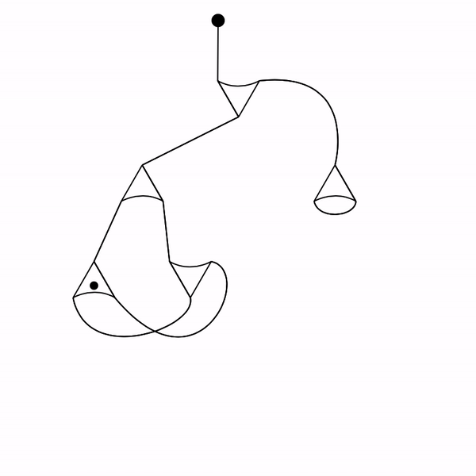

# Nasic Render

This tool is used to create an animation of the reduction process of interaction nets for [Nasic](https://github.com/MaiaVictor/Nasic) (N-Ary Symmetric Interaction Combinators).

## Usage
> It's recommended have a sketch before defining the type and position of the nodes.

1. Go to the root folder and run a local server. 
2. Open `http://localhost:8080` to visualize the canvas.

Edit function `makeNodes()` to setup nodes properties.
We start creating an empty node's array, an initial node and the other nodes. 

``` javascript
function makeNodes() {
    var nodes = [];
    var initialNode = new Node(0, {x: width * 0.47 - 5, y: height * 0.05}, getRadianFromAngle()); 
    var node0 = new Node(1, {x: width * 0.5, y: height * 0.2}, getRadianFromAngle(90));
    var node1 = new Node(1, {x: width * 0.3, y: height * 0.40}, getRadianFromAngle());
    ...
}
```

After pushing the nodes into the array and identifing them, we have to connect their ports. Again, it's highly recommended have a sketch before doing this. 
``` javascript
 // Connections between ports
    connectPorts([node0, 0], [node1, 0]);
    connectPorts([node0, 1], [node4, 0]);
    connectPorts([node0, 2],[initialNode, 0]);
    ...
```

## Making an animation 
- **Single click**: select an element
- **Click and move**: updates an element position. Can be done in nodes and pivots. 
- **Click and use arrow keys**: updates an element angle, makes a rotation
- **Space bar**: saves an state of nodes' info as position, rotating, ports, etc.
- **Press crtl/cmd and click** a node to check if can do a transformation (reduction or duplication). If it can transform, the transformation will occur, otherwise nothing happens. 
- **Press 'x'** to remove the last state of nodes saved
- **Press 'h'** to hide pivots position
- **Press 'p'** to play an animation

> Tip: to make a smooth animation, do small changes on the position and rotation of the elements and save them. More states saved, more smooth is the animation. 


